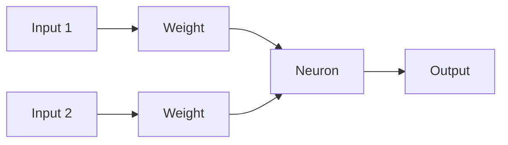
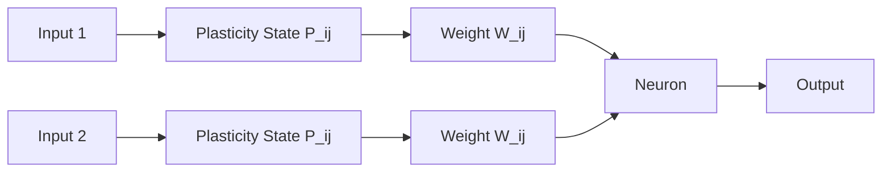

# Neuroplastic_Perceptron
An experimental machine learning research project investigating whether connectivity can become a learnable component of neural networks through mathematically defined neuroplasticity rules.
# Neuroplastic Perceptron

> Experimental machine learning research project exploring whether neural connectivity can become a learnable and adaptive component of neural networks through mathematically defined neuroplasticity rules.

---

## Research Question

Modern neural networks learn connection weights while maintaining a largely fixed connectivity structure.

Biological neural systems appear to operate differently. Through neuroplasticity, neural connections can strengthen, weaken, emerge, and disappear over time.

This project investigates a fundamental question:

> **Can connectivity itself become a learnable component of neural networks rather than a fixed architectural choice?**

---

## Motivation

Over the last decade, deep learning has achieved remarkable success across computer vision, natural language processing, recommendation systems, and scientific computing.

Despite these achievements, most neural network architectures rely on a common assumption:

* Architecture remains fixed.
* Learning occurs primarily through weight optimization.

Biological neural systems suggest a different paradigm.

The brain does not only modify synaptic strengths. It also continuously reorganizes its connectivity structure through mechanisms collectively known as neuroplasticity.

This project explores whether similar principles can be incorporated into artificial learning systems.

---

## Background

Recent research has explored Dynamic Sparse Training (DST), where network topology changes during training.

Examples include:

* Sparse Evolutionary Training (SET)
* RigL
* Dynamic Sparse Reparameterization
* Structured RigL

These methods demonstrate that adaptive connectivity can improve parameter efficiency and computational scalability.

However, based on the literature reviewed so far, connectivity is generally modified through pruning and regrowth heuristics derived from:

* Weight magnitude
* Gradient magnitude
* Sparsity schedules
* Structural constraints

This project investigates whether connectivity itself can be represented as a continuously evolving state variable rather than a binary pruning decision.

---

## Traditional Neural Networks vs Neuroplastic Perceptron

### Traditional Neural Networks



Learning occurs by updating weights while connectivity remains fixed.

---

### Neuroplastic Perceptron (Conceptual)



Learning occurs through both:

* Weight adaptation
* Connectivity adaptation

---

## Neuroplastic Perceptron Hypothesis

Traditional neural networks learn only weight parameters:

```text
W_ij
```

Neuroplastic Perceptron proposes introducing an additional variable:

```text
P_ij
```

where:

* `W_ij` represents connection strength.
* `P_ij` represents connectivity strength or plasticity state.

The effective contribution of a connection becomes:

```text
Output = Σ(P_ij × W_ij × x_j)
```

In this framework:

| Component | Purpose                    |
| --------- | -------------------------- |
| W_ij      | Information transformation |
| P_ij      | Connectivity dynamics      |
| x_j       | Input activation           |

The central hypothesis is that both weights and connectivity may evolve during learning.

---

## Towards a Mathematical Law of Connectivity

Instead of manually pruning and regrowing connections, Neuroplastic Perceptron explores whether connectivity can evolve according to mathematically defined dynamics.

Potential influences include:

* Activation history
* Information contribution
* Gradient influence
* Long-term usefulness
* Resource constraints

Conceptually:

```text
dP_ij/dt = Plasticity_Function(...)
```

where the plasticity function governs:

* Connection formation
* Connection reinforcement
* Connection weakening
* Connection removal

Rather than explicitly deciding which connections should exist, connectivity may emerge from the dynamics of the system itself.

---

## Comparison with Existing Approaches

| Feature                                        | Traditional Neural Networks | Dynamic Sparse Training | Neuroplastic Perceptron |
| ---------------------------------------------- | --------------------------- | ----------------------- | ----------------------- |
| Learns Weights                                 | ✓                           | ✓                       | ✓                       |
| Dynamic Connectivity                           | ✗                           | ✓                       | ✓                       |
| Connectivity as Continuous State               | ✗                           | ✗                       | Research Goal           |
| Connectivity Governed by Mathematical Dynamics | ✗                           | ✗                       | Research Goal           |
| Biological Inspiration                         | Limited                     | Partial                 | Strong                  |

---

## Research Roadmap

### Phase 1 — Neuroplastic Perceptron (Current)

* Study Dynamic Sparse Training literature
* Analyze existing connectivity adaptation methods
* Develop mathematical formulations for connectivity evolution
* Design baseline Neuroplastic Perceptron models
* Evaluate on benchmark tasks

### Phase 2 — Neuroplastic Multi-Layer Networks

* Extend adaptive connectivity mechanisms to hidden layers
* Analyze emergent sparse structures
* Investigate parameter efficiency
* Study generalization behavior

### Phase 3 — Alternative Geometric Learning Frameworks

Future exploratory directions include:

* Multi-region decision boundaries
* Alternative similarity measures
* Non-Euclidean geometric representations
* Geometry-inspired learning dynamics

These directions remain exploratory and will only be investigated after establishing a rigorous neuroplasticity framework.

---

## Current Status

Active Research

Current work focuses on:

* Literature review
* Dynamic Sparse Training
* Connectivity adaptation mechanisms
* Neuroplasticity-inspired learning
* Mathematical modeling of adaptive connectivity

No performance claims are made at this stage.

---

## Repository Structure

```text
Neuroplastic_Perceptron/
│
├── README.md
│
├── References/
│   ├── Papers/
│   ├── Literature_Reviews/
│   └── Related_Work.md
│
└── Research_Notes/
    ├── Research_Journal.md
    ├── Ideas.md
    ├── Experiments.md
    └── Future_Directions.md
```

---

## Disclaimer

This repository documents an ongoing research investigation.

The ideas presented here should be interpreted as hypotheses and active areas of exploration rather than established results.

The objective is to investigate whether adaptive connectivity dynamics can provide useful learning behavior beyond existing sparse training approaches.

---

## Maintainer

**Gautam Chand**

Independent Machine Learning Research

---

## References

The project currently draws inspiration from research in:

* Sparse Evolutionary Training (SET)
* RigL
* Dynamic Sparse Training (DST)
* Neuroplasticity
* Computational Neuroscience
* Adaptive Network Topologies

Detailed literature reviews and paper summaries are maintained in the `References/` directory.
